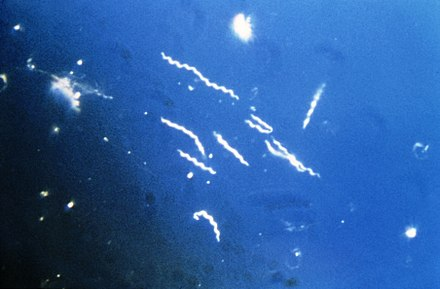

```{r}
SeqData <- read.csv("Sequences.csv", header =TRUE, row.names = 1)
print (SeqData$Sequences)

#Printing each sequence
print(as.character(SeqData$Sequences[1]))
print(as.character(SeqData$Sequences[2]))
print(as.character(SeqData$Sequences[3]))

```

```{r}
#Discovering the amount of each nucleotide within each of the three sequences
A <- gsub("[TCG]", "", as.matrix(SeqData$Sequences))
OnlyA <- print(nchar(A, type ="chars"))

T <- gsub("[ACG]", "", as.matrix(SeqData$Sequences))
OnlyT <- print(nchar(T, type ="chars"))

C <- gsub("[ATG]", "", as.matrix(SeqData$Sequences))
OnlyC <- print(nchar(C, type ="chars"))

G <- gsub("[ACT]", "", as.matrix(SeqData$Sequences))
OnlyG <- print(nchar(T, type ="chars"))
```


```{r}
library(knitr)
library(dplyr)

#Creating a Table
SequenceID <- c("HQ433692.1", "HQ433694.1", "HQ433691.1")
NuTable <- transmute(SeqData, SequenceID, OnlyA, OnlyT, OnlyC, OnlyG)

knitr::kable(NuTable,
             col.names = c("SequenceID","Adenine Count","Thymine Count", "Cytosine Count","Guanine Count"))

```

```{r}
#GC Content Calculations
gcContent <- mutate(NuTable, (OnlyC + OnlyG)/(OnlyC + OnlyG + OnlyA + OnlyT)*100)
names(gcContent) <- c("SequenceID", "OnlyA", "OnlyT", "OnlyC", "OnlyG", "GC Content")

gcTable <- select(gcContent, "SequenceID", "GC Content")
print(gcTable)
```

[Click HERE to reach the Borrelia_burgdorferi wikipedia page](https://en.wikipedia.org/wiki/Borrelia_burgdorferi)
```{r}


```


```{r}
install.packages("ggplot2")
library(ggplot2)
NEWData <- read.csv("GC_content.csv", header =TRUE)
TableNEWData <- mutate(NEWData, "GC_Content" = (G + C))

qplot (x=ID, y=GC_Content, data=TableNEWData, xlab="Species Identifier", ylab="Percent GC Content", main="Percentage GC Content for 1000 Specimens for 3 different species", colour = Species)
```


